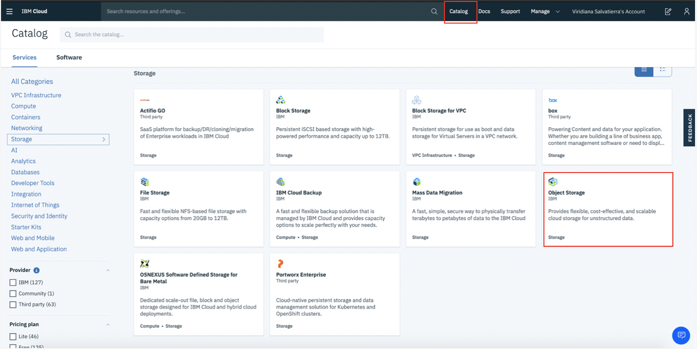
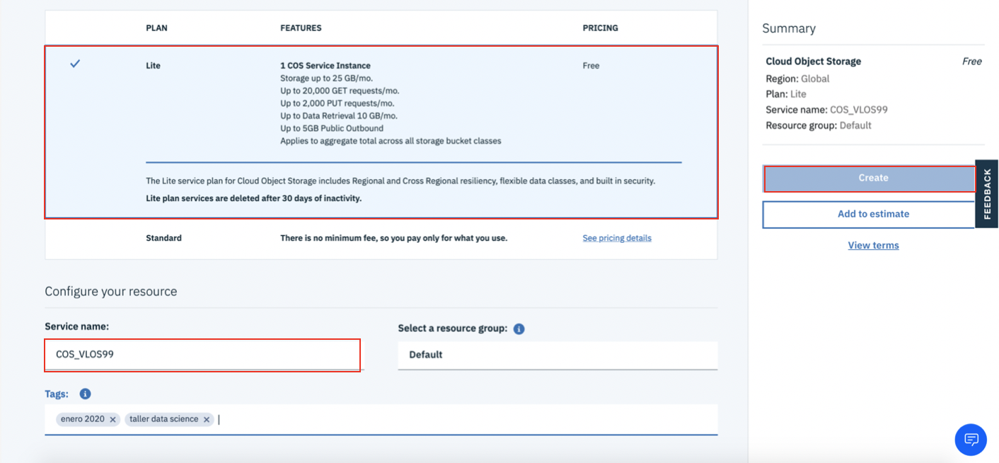
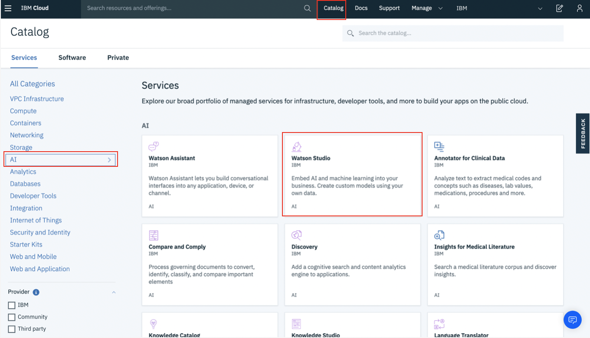
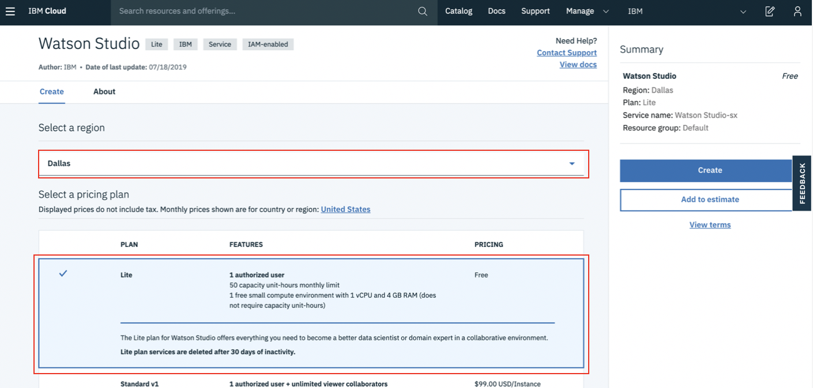
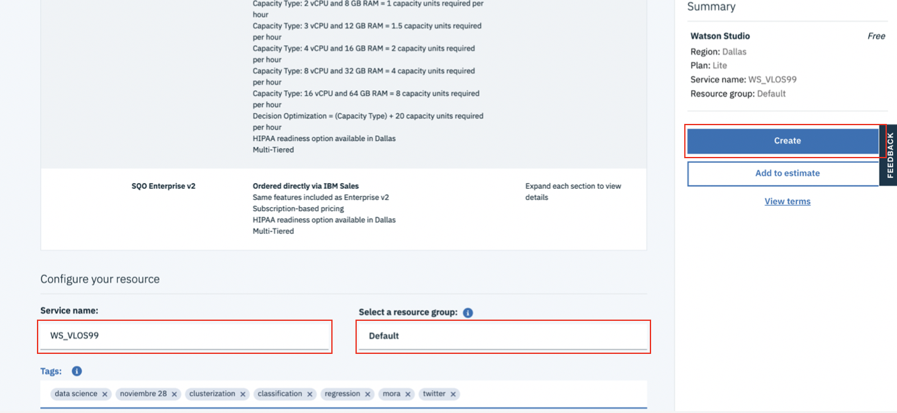
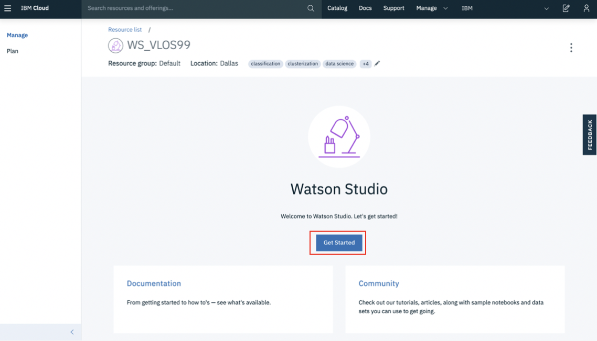
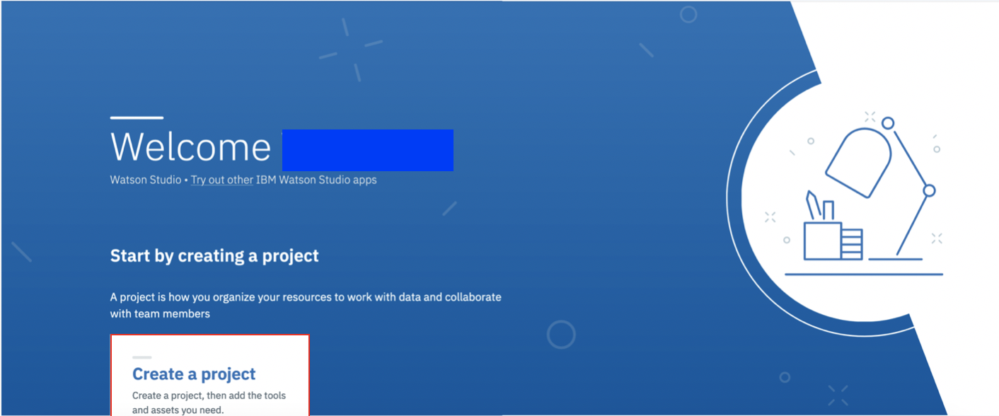
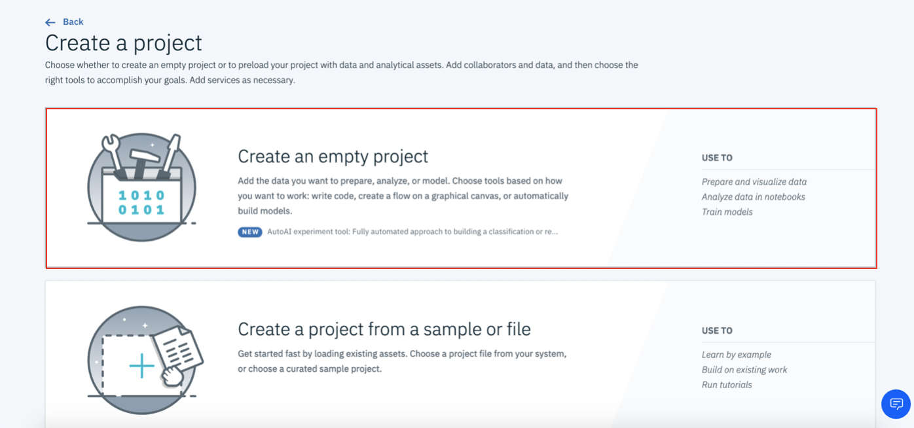
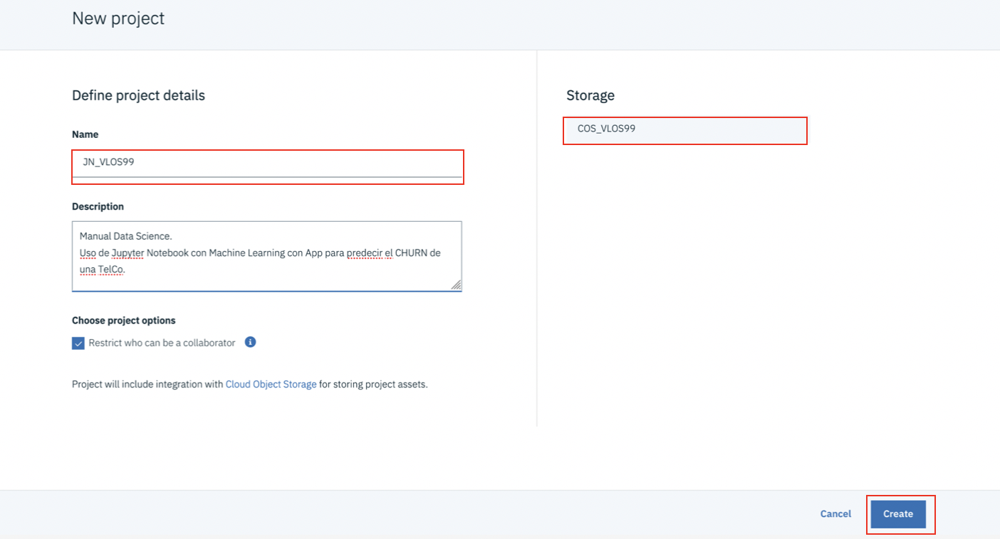
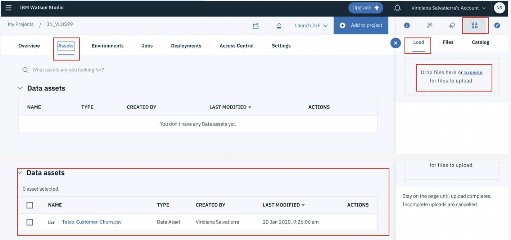

[![IBM Cloud powered][img-ibmcloud-powered]][url-ibmcloud]
# Data Science-Lab 1
Aprende en este laboratorio a crear una instancia de Watson Studio y cargar un dataset!
# Pre-requisitos
* Tener instalado [**github Desktop**](https://desktop.github.com) o [**git cli**](https://git-scm.com/book/en/v2/Getting-Started-Installing-Git).
* Tener instalado el [**CLI de IBM Cloud**](https://cloud.ibm.com/docs/cli?topic=cloud-cli-getting-started) (Si tienes problemas con este paso, da clic [**aquí**](https://cloud.ibm.com/docs/cli?topic=cloud-cli-install-ibmcloud-cli) para descargar la versión “STANDALONE”).
* Descargar el repositorio del siguiente [**enlace**](https://github.com/ibmdevelopermx/CHURN-app-Jupyter-Notebook-y-WS).

## Cupones para profesores y estudiantes:

* Acceder al portal de [IBM Academic Initiative][url-academic] y seleccionar la opción "Register now" si aun no tienes cuenta.
* Realizar el registro correspondiente utilizando la cuenta de correo académica y confirma tu cuenta.
* Despues de confirmar tu cuenta, y con la sesion iniciada en IBM Academic Initiative, en la parte de "Most Popular Topics covered", encontraremos **IBM Cloud** y damos clic en "Learn more".
* Bajamos de la pagina hasta encontrar "Software". Le damos clic, nos dara un apartado que se llama "Request Feature Code".
* Nos dara nuestro codigo. Lo copiamos y lo llevamos a **IBM Cloud**.

## Cargar créditos en IBM Cloud:

* En la parte superior derecha, buscaremos la parte de "MANAGE"/"GESTIONAR", nos desplegara una lista y seleccionaremos "Account"/"Cuenta".
* De lado izquierdo, tendremos una opción "Account settings"/"Configuracion de cuenta".
* Bajamos un poco hasta encontrar "Subscription and feature codes"/"Codigos de suscripción y carateristicas".
* Da clic en "Apply code"/"Aplicar codigo".
* Ingresamos el codigo y clic en "Apply"/"Aplicar".

## 1. Crear una instancia de Cloud Object Storage.
1.	Realizamos login a IBM Cloud
http://cloud.ibm.com
2.	Seleccionamos “Catalog” (Catálogo) en el menú superior.
3.	En las categorías de la izquierda, seleccionamos “Storage”.
4.	Seleccionamos el servicio de “Object Storage”.

5.	Seleccionamos el plan “Lite”, le damos un nombre a nuestra instancia de servicio y damos clic en “Create”.

## 2. Crear una instancia de Watson Studio:
1.	Realizamos login a IBM Cloud
http://cloud.ibm.com
2.	Seleccionamos “Catalog” (Catálogo) en el menú superior.
3.	En las categorías de la izquierda, seleccionamos “AI”.
4.	Seleccionamos el servicio de “Watson Studio”

5.	Una vez dentro del servicio, seleccionamos la región “Dallas”.
6.	Seleccionamos el plan “Lite”.

7.	En la parte inferior de la página, escribir el “Nombre de la instancia del Servicio”. (Es recomendable agregar etiquetas o “tags”)
8.	En grupo de recursos, dejamos el valor “Default”. 
9.	Dar clic en “Create”.

10.	En la pestaña que se despliegue, damos clic en “Get Started” de la pestaña “Manage”.

## 3. Crear un proyecto:
1.	Una vez en la página principal de nuestra instancia, damos clic en “Create a project”.

2.	Seleccionamos la opción “Create an empty project”.

3.	Ahora, le damos un nombre al proyecto, comprobamos que nuestra instancia de “Cloud Object Storage” sea correcta y damos clic en “Create”.

## 4. Cargar un data asset:
1.	Una vez dentro del proyecto que acabamos de crear, damos clic en “Assets”. Del lado derecho, en el apartado de “Find and add data”, seleccionamos “Browse” o arrastramos y soltamos el archivo “Telco-Customer-Churn.csv” de la carpeta “Data” del repositorio que recién clonamos.

[url-academic]: https://my15.digitalexperience.ibm.com/b73a5759-c6a6-4033-ab6b-d9d4f9a6d65b/dxsites/151914d1-03d2-48fe-97d9-d21166848e65/home/
[img-ibmcloud-powered]: https://img.shields.io/badge/IBM%20Cloud-Powered-blue.svg
[url-ibmcloud]: https://www.ibm.com/cloud/

Y listo! Puedes continuar con el siguente lab [**AQUI**](https://github.com/Rostizadobb/Data-Science-Lab-2).
Te invitamos a explorar otros talleres y manuales en el siguiente enlace de Github.
https://github.com/ibmdevelopermx
